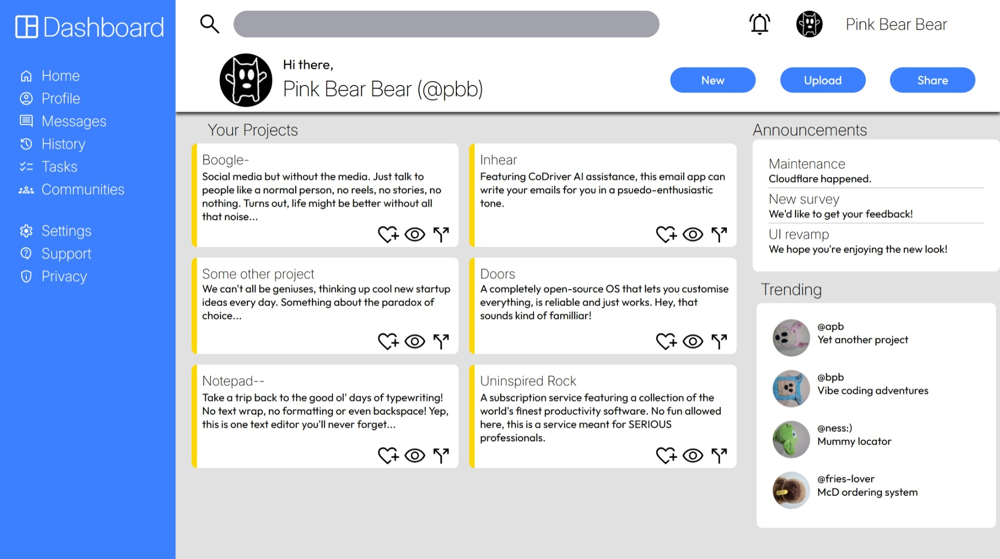

# admin-dashboard
Admin dashboard project based on The Odin Project curriculum.

Live demo link: https://j0e-quan.github.io/admin-dashboard/

## Technologies used:
 - HTML for basic page layout and images
 - CSS for styling elements and use of web fonts (Inter for headings, Outfit for body text)
 - CSS Grid was used to organise page content (this project did not involve Flexbox)
 - Git for version control

## Key features:
 - Layout split into several sections with CSS Grid
 - Web fonts improve appearance and legibility

## Credits:
 - Icons used were from Material Icons
 
## Gallery:
